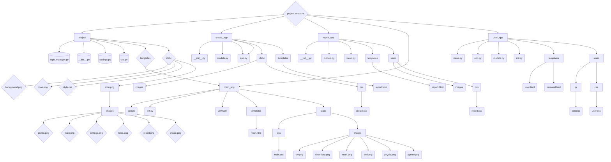

## Назва проекту: сайт з інтеграцією чата ГПТ / name project: site with the integration of the chat GPT.

### опис:
* Це сайт з питаннями та ШИ асистентом.

#### description:
* This is a site with questions and AI assistant.

[Особиста сторінка / Personal Account Page](######особиста-сторінка/personal-account-page)
##### виконавці / create by: 
[Ілля Епік / Illya Epik](https://github.com/IllyaEpik/knowex)
[Макс Субач / Max Subach]()
[Марк Попович / Mark Popovich]()
[Конев Олексій / Konev Oleksii]()
[Маринченко Андрій / Marynchenko Andrey]()
[Олександр Шорніков / Oleksandr Shornikov](https://github.com/sasha-stelc)

###### сторінка create / page create:
Сторінка create надає змогу створити свій тест за допомогою ШИ, макету або власноруч. Виставити такі параметри як клас та предмет. Також з цієї сторінки можно перейти на сторінки: Уроки, Тести, Прогрес, Мої модулі, Налаштування, Профіль. / Create page allows you to create your test with a AI, layout or your own. Setting such parameters as class and subject. You can also go from this page to pages: lessons, tests, progress, my modules, settings, profile.

###### сторінка report / page report:
На сторінці report можно побачити свої виконані тести та їх результати. Також з цієї сторінки можно перейти на сторінки: Уроки, Тести, Прогрес, Мої модулі, Налаштування, Профіль. / On the Report page you can see your completed tests and their results. You can also go from this page to pages: lessons, tests, progress, my modules, settings, profile.

###### сторінка реєстрації / page registration:
Сторінка реєстрації дозволяє новим користувачам створити обліковий запис, заповнивши необхідні дані, такі як ім’я, електронна пошта та пароль. Після успішної реєстрації користувач може увійти в систему та отримати доступ до функціоналу платформи. Також з цієї сторінки можна перейти на сторінку входу. / The registration page allows new users to create an account by filling in required information such as name, email, and password. After successful registration, the user can log in and access the platform's features. You can also go from this page to the login page.

###### сторінка входу / page login:
Сторінка входу дозволяє користувачам увійти до свого облікового запису, використовуючи електронну пошту та пароль. Якщо користувач ще не зареєстрований, він може перейти на сторінку реєстрації для створення нового облікового запису. / The login page allows users to sign in to their account using their email and password. If the user is not registered yet, they can go to the registration page to create a new account.

###### Головна сторінка / Main page:  
Головна сторінка платформи Knovex вітає користувачів та пропонує обрати предмет для навчання, наприклад, біологію чи математику. Користувачі можуть увійти до системи через кнопку "Login" або зареєструватися за допомогою кнопки "Register". / The main page of the Knovex platform welcomes users and offers them to choose a subject to study, such as biology or mathematics. Users can log in to the system via the "Login" button or register using the "Register" button.
Уроки / Lessons – через бічне меню зліва (іконка з книгою).
Тести / Tests – через бічне меню (іконка з галочкою).
Прогрес / Progress – через бічне меню (іконка з графіком).
Мої модулі / My Modules – через бічне меню (іконка з папкою).
Налаштування / Settings – через бічне меню (іконка з шестернею).
Профіль / Profile – через бічне меню (іконка з людиною).
Сторінка входу / Login Page – натиснувши кнопку "Login".
Сторінка реєстрації / Registration Page – натиснувши кнопку "Register".

###### Особиста сторінка / Personal Account Page:
Особиста сторінка відображає інформацію про користувача, таку як ім’я, електронна пошта. Користувач також може змінити пароль, відновити доступ до облікового запису або підключити двохфакторну аутентифікацію. / The personal account page displays user information such as name and email. Users can also change their password, recover account access, or enable two-factor authentication.

