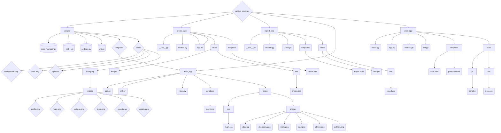

```mermaid
graph TD
    P{project structure}
    P --> C[project]
    P --> H[create_app]
    P --> WER[report_app]
    
    C --> C1[(login_manager.py)]
    C --> C2[(__init__.py)]
    C --> C3[(settings.py)]
    C --> C4[(urls.py)]
    C --> C5{templates}
    C5 --> M[base.html]
    C --> C6{static}
    C6 --> SW{background.png}
    C6 --> SW1{book.png}
    C6 --> SW2{style.css}
    C6 --> IC[icon.png]
    IC --> IMAGES[images]
    IMAGES --> WSA{profile.png}
    IMAGES --> WSA1{main.png}
    IMAGES --> WSA2{settings.png}  
    IMAGES --> WSA3{tests.png}
    IMAGES --> WSA4{report.png}
    IMAGES --> WSA5{create.png}
    
    H --> H1(__init__.py)
    H --> H2(models.py)
    H --> H3(views.py)
    H --> H3(app.py)
    H --> st(static)
    st --> im(images)
    st --> cssz(css)
    cssz --> creatcss(create.css)
    H --> Htem(templates)
    Htem --> Htem1(report.html)


    WER --> WER1(__init__.py)
    WER --> WER2(models.py)
    WER --> WER3(views.py)
    WER --> VOD(templates)
    VOD --> VOD1(report.html)
    WER --> SVO(static)
    SVO --> OVS(images)
    SVO --> OVS1(css)
    OVS1 --> OVSZ(report.css)


    P{project structure}
    P --> M[main_app]
    P --> U[user_app]
    M --> A(app.py)
    M --> I(init.py)
    M --> V(views.py)
    M --> T[templates]
    M --> S[static]
    S --> CER[css]
    CER --> MAI(main.css)
    S --> IM[images]
    IM --> UK(ukr.png)
    IM --> CH(chemistry.png)
    IM --> MTH(math.png)
    IM --> E(end.png)
    IM --> PH(physic.png)
    IM --> PY(python.png)
    T --> MA(main.html)
    U --> VI(views.py)
    U --> AP(app.py)
    U --> MO(models.py)
    U --> IN(init.py)
    U --> TE[templates]
    TE --> UH(user.html)
    TE --> PHE(personal.html)
    U --> ST[static]
    ST --> J[js]
    J --> SJ(script.js)
    ST --> CS[css]
    CS --> UC(user.css)
```
сделай чтоб файлы выглядили одинаково и папки отличались от файлов и тоже выглядили одинаково не меняя цвет только форму и на добавляй никаких пояснений в код

